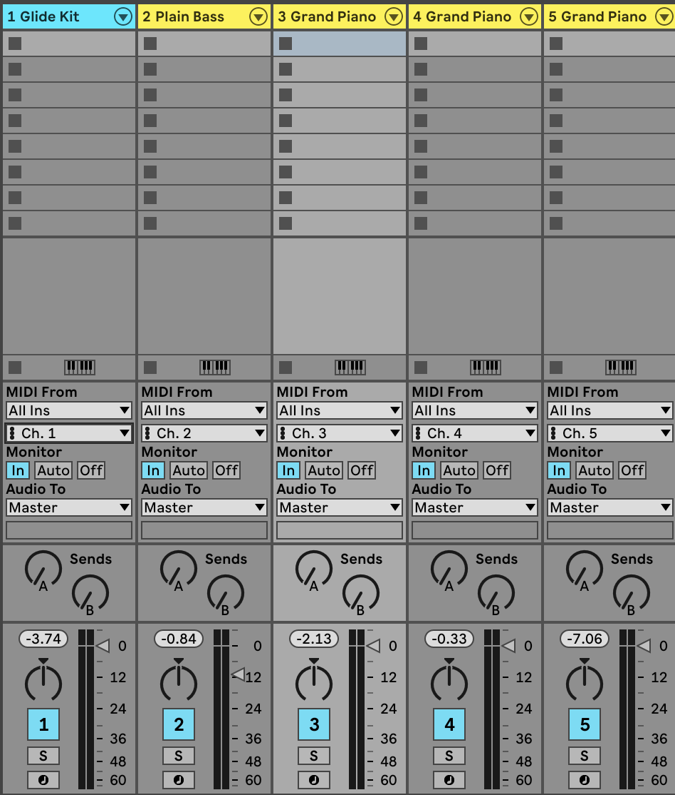

# Music Generation with Machine Learning and Multi-Agent Systems

## Description
This project is developed as part of a master thesis with the aim of exploring and implementing innovative solutions in the field of music generation. By using machine learning techniques in collaberation with concepts from Multi-Agent Systems, I strive to create a unique and framework capable of generating aesthetically pleasing musical compositions.

## Status: Work in Progress
Please note that this project is currently a Work in Progress (WIP). This means that not all features are fully implemented, and the project is in active development.

## Dependencies and Setup
Dependencies required to run this project are listed in the requirements.txt file. Install them using:
```bash
pip install -r requirements.txt
```

### Models
Training models requires several hours, even on high-performance computers. To train your own models, run the following command with these arguments:
```bash
python main.py
```
With these args:
-tb: train bass model
-tc: train chord model
-td: train drum model
-tm: train melody model

To use pretrained models, download them using gdown from the root directory:

### Bass model
```bash 
gdown https://drive.google.com/uc?id=1_QI0Ynh-nXKvvJR2tfUM_BXLT_ixuUkf -O models/drum/drum_model.pt
```

### Chord model
```bash 
gdown https://drive.google.com/uc?id=1aeACzuW1D-t0DoFUfZQQXNTX4aAajIRv -O models/chord/chord_model.pt
```

### Drum model
```bash 
gdown https://drive.google.com/uc?id=123eaHn9ab9jWdTKzkpWxlJJ1WUoRCND0 -O models/drum/drum_model.pt
```

### Melod model
```bash 
gdown https://drive.google.com/uc?id=1nUGb2Mbs4Z_ulcG374OVaY2ud_uomIjg -O models/melody/melody_model.pt
```

# Usage
Once the dependencies are installed and the models are either trained or downloaded, run the program:
```bash
python main.py
```
This will automatically open a localy hosted app in your browser. In the app you can tune parameters an create your own music.

## Getting sound
To play the generated music, you need a MIDI player capable of listening to multiple MIDI ports simultaneously. The music will be broadcast to virtual MIDI channels on your computer and picked up by the MIDI player.

The agents and their channels are as follows:

- Channel 1: Drum
- Channel 2: Bass
- Channel 3: Chord
- Channel 4: Melody
- Channel 5: Harmony

Below is an example setup in Ableton Live 11:




## Acknowledgments
Special thanks to Kyrre Glette for supervising this master's project.
Thanks to Çağrı Erdem for assistance with the implementation of the MIDI broadcasting loop.
Appreciation to the Bumblebeat project for inspiration and foundational work in drum generation.
[Bumblebeat Project](https://github.com/thomasgnuttall/bumblebeat/tree/master)